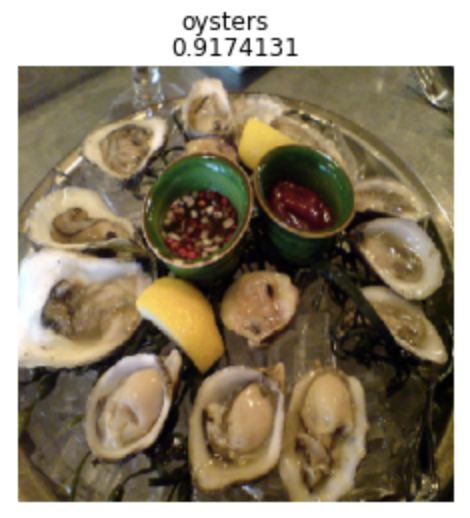
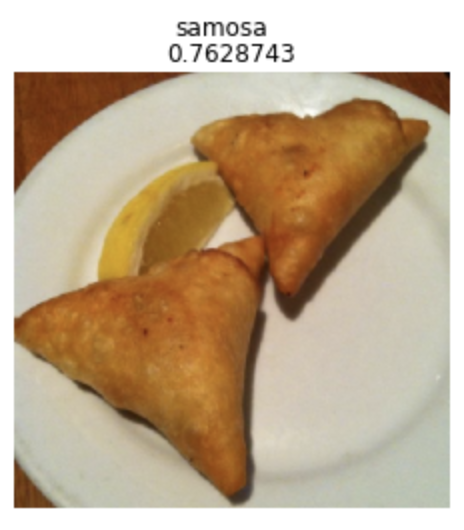
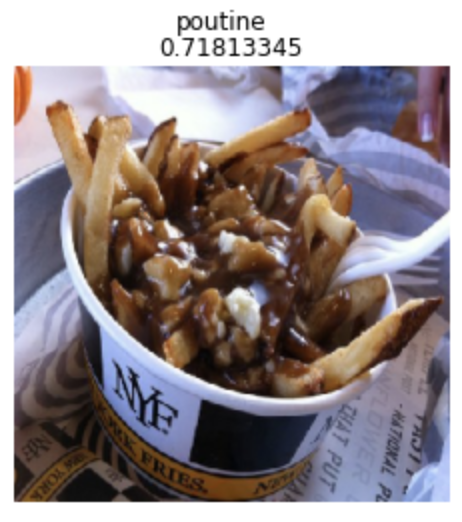

# Food Image Classification using Transfer Learning
This project uses Transfer Learning with the InceptionV3 model to classify food images into 101 categories. The model is implemented with Tensorflow. 

## Dataset
All images are from the [Food-101](https://data.vision.ee.ethz.ch/cvl/datasets_extra/food-101/) dataset, which is composed of 101,000 images from 101 food categories. Each category consists of 750 training images and 250 testing images. The full class list can be found in the classes.txt. 

## Results
Training accuracy: 81.67%
Validation accuracy: 77.15% 

## Model
Model can be accessed here: [link](https://drive.google.com/file/d/1Ewq_YEnFfi0h0DXt1gu96q_RRxaV9aYs/view?usp=drive_link)
